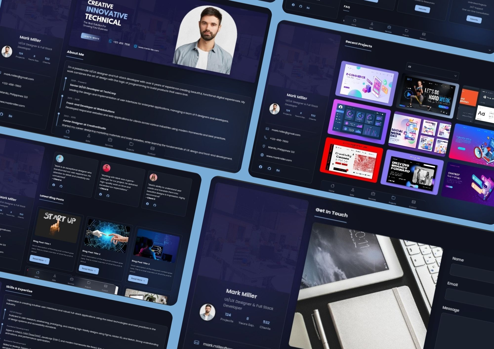
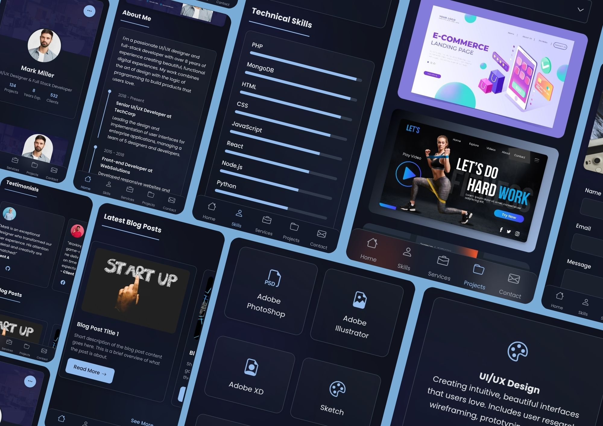

# Mark Miller - Web Portfolio Template

## Overview

The **Mark Miller** is a responsive and modern portfolio website designed for showcasing your skills and projects. This template is perfect for UI/UX designers, developers, and anyone looking to create an online presence.

- **Name**: JohnDev19
- **Creation Date**: February 2025
- **Last Update**: February 2025
- **Live**: https://markmiller.vercel.app/

## Features

- **Responsive Design**: Adapts to various screen sizes and devices.
- **Smooth Navigation**: Easy-to-use navigation bar for quick access to sections.
- **Sections**:
  - About Me
  - Testimonials
  - Latest Blog Posts
  - Skills & Expertise
  - Services
  - Subscription Plans
  - FAQ
  - Recent Projects
  - Contact Form
- **Customizable**: Easily modify styles and content to fit your personal brand.

## Usage

- **Customization**: Modify the HTML and CSS files to personalize the content, styles, and layout.
- **Images**: Replace placeholder images in the `assets/images/` directory with your own images.
- **Deployment**: Host your portfolio on platforms like GitHub Pages, Netlify, or Vercel for easy access.

## License

This project is licensed under the MIT License. See the [LICENSE](LICENSE) file for details.

## Acknowledgments

- Special thanks to [Bootstrap Icons](https://icons.getbootstrap.com/) for the icon library.

Feel free to modify any sections to better fit your project or personal style!
